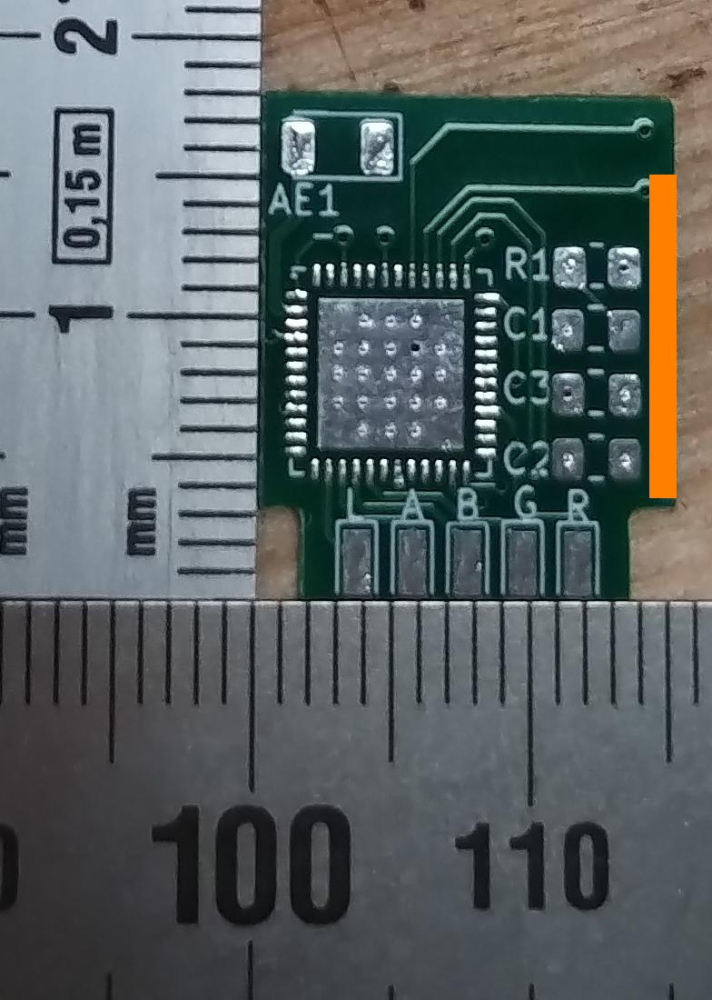

# SM-028_v1.3-to-ESP32-PICO-D4
passive pcb adapter-plate (drop-in replacement) for SM-028_v1.3 Wi-Fi Module to a ESP32-PICO-D4

## Executive Summary
* This projects provides a drop-in replacement for a "[TROLINK SM-028_V1.3 BL602L20](https://www.elektroda.com/rtvforum/topic3945435.html)". 
* This project consists of a KiCad project that gives you the Gerber files to order a PCB (e.g. at [JLCPCB](https://cart.jlcpcb.com)) onto which one ESP32-PICO-D4, three capacitors, one antenna and one resistor are soldered.  
* For the impatient: Go to [Installation](#Installation). 
* I did this for [these E27 lamp holders](https://www.aliexpress.com/w/wholesale-Wifi-Smart-Light-Bulbs-Adapter-Mini-e27-Lamp-Holde.html?spm=a2g0o.productlist.search.0).

## Picture

## Sidenotes
This is yet another quick hack project and thus neither very polished nor professional - plz use at your own risk. The readme is long (as usual), as I want to document the journey.  
Despite the verbosity of the readme, it assumes that you know how to solder micro lead frame (MLF) packages and some basic electronics. Some things here are weirdly specific, while some are infuriatingly generic (assuming a lot of knowhow). 

## Preamble (Why)
Some years ago (in the dawn of IoT), Sonoff manufactured a 'smart E27 lampholder' called Slampher (that had an esp8266 inside). I bought some, b/c my parents wanted to switch lights on and off to a given schedule when they were out, and Tasmota provides a nice way to do that w/o a central control station. Unfortunately, the Slampher was discontinued (who still needs this if you can buy an E27 bulb with an ESP inside). So I bought what I thought was yet another WiFi enabled E27 holder on Ali (see above) - just to find out that there was no ESP chip inside. The WiFi module proved to be not hackable :-(. 

Long story short: Once again I compared the voltages and signal pins - turns out these fit to an ESP! [So here we go again](https://www.youtube.com/watch?v=dTAAsCNK7RA) I guess. 

## Pin-mapping
|row #| SM-028_v1.3 (pad)| SM-028_v1.3 (usage in E27) | ESP32 (pin)|
--- | --- | --- | ---
|1|L (front)| n/a |GPIO25 (14)|
|2|A (front) |GND| GPIO26 (15)|
|3|B (front) |relais| GPIO27 (16)|
|4|G (front)|button|GPIO14 (17)|
|5|R (front) |n/a|GPIO19 (38)|
|6|3V3 (back)|VCC|VCC (1 and others)|
|7|GND (back) |GND|GND (49 pad)|
|8|22 (back) |blue LED|GPIO22 (39)|
|9|17 (back)|n/a|GPIO4 (24)|
|10|C (back)|n/a|GPIO9 (28)|
|11|W (back)|n/a|GPIO23 (36)|

## Design Decisions
* Size must not be larger than the SM-028_v1.3 module (so that it is in fact a drop in replacement).
* Drop-in replacement, thus all pins must retain the same position and function
* Utilize as many ESP pins as possible (no empty pads on module).
* Have the least amount of components possible (I hate placing and soldering chicken feed). 
* Price does not matter (favour integration over lots of components).
* Have test-pads for soldering on leads for GND, VCC, GPIO0, RX, TX for flashing. 
* All components on one side for easier reflow soldering.
* Have a component antenna (not an etched one; I stole the antenna-idea from the [Picoclick-C3](https://github.com/makermoekoe/Picoclick-C3)). 
* I chose 0805 b/c there was enough space, the antennae was large anyway, and b/c it's easier to solder. Sue me.

## BOM (for 1 module; each part needed once)
* PCB (see [Installation](#Installation)).
* ESP32-PICO-D4 
* R1: 12k 0805
* C1: 0.1 μF 0805
* C3: 1 μF 0805
* C2: 10 μF 0805
* AE1: ANT3216LL00R2400A

## Installation
* Go to [JLCPCB](https://cart.jlcpcb.com/quote) and upload the [gerbers.zip](gerber/FCK_SM-028_V1.3-gerbers.zip). Sidenote: I'm neither sponsored nor do I endorse them specifically, I just find them convenient. <b>Make sure you select the correct PCB thickness (0.8 mm).</b> I also set "Remove Order Number" to "Specify a location" (layout contains a field for this). No other special settings. I also purchased a stencil (YMMV). 
* Get the parts. 
* Reflow the components (I use [this](https://eu.mouser.com/ProductDetail/Chip-Quik/SMDLTLFP?qs=aBQo9TmGG4V1bvEQuyksHg%3D%3D)).  
* Solder jumper wires to the pads on the back, and flash your desired image (note: the ESP32 might need a boot-loader flashed too).

## Software
* I use this [ESPHome config](ESPhome/esp32test.yaml) config.

## License and Legalese
* May be (re)used for personal/private use only and not sold/licensed for commercial or financial gain. This non-standard license should make it impossible and really difficult for commercial enterprises to profit from my work (pay people to design this!), but enable the hobbyist/enthusiast to work with it. 
* If I have inadverently (re-)used your work without either properly attributing it or something, please let me know - I'd be happy to correct this.

## Donations
Yes please.

## Feedback
Also yes please! (I hope I figure out how this whole pull-request thing works...)

## Shoutout ...
* ... to [CCC](https://www.ccc.de) and [CCCZH](https://www.ccczh.ch/)!
* ... to all FOSS contributors that helped making SW that enabled me to do this. Nanos gigantium humeris insidentes.
